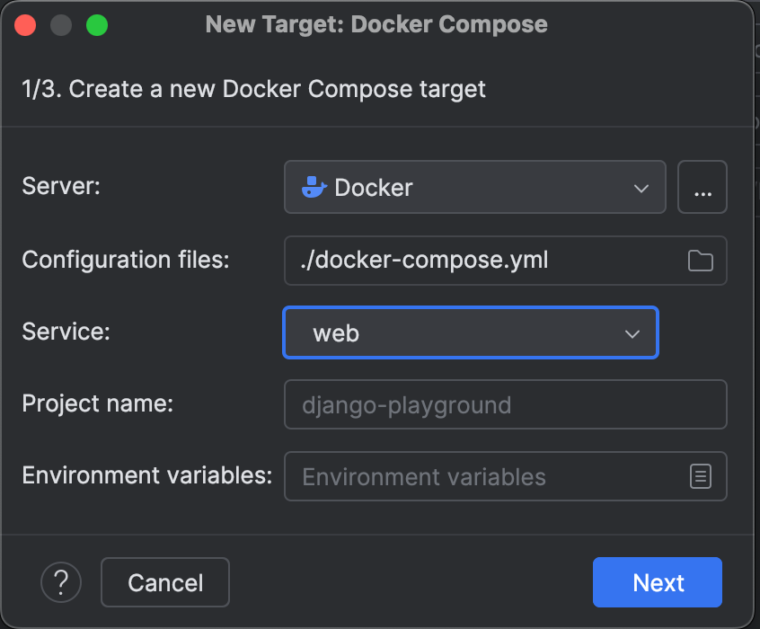
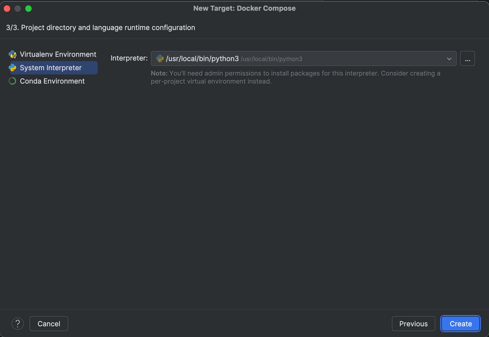
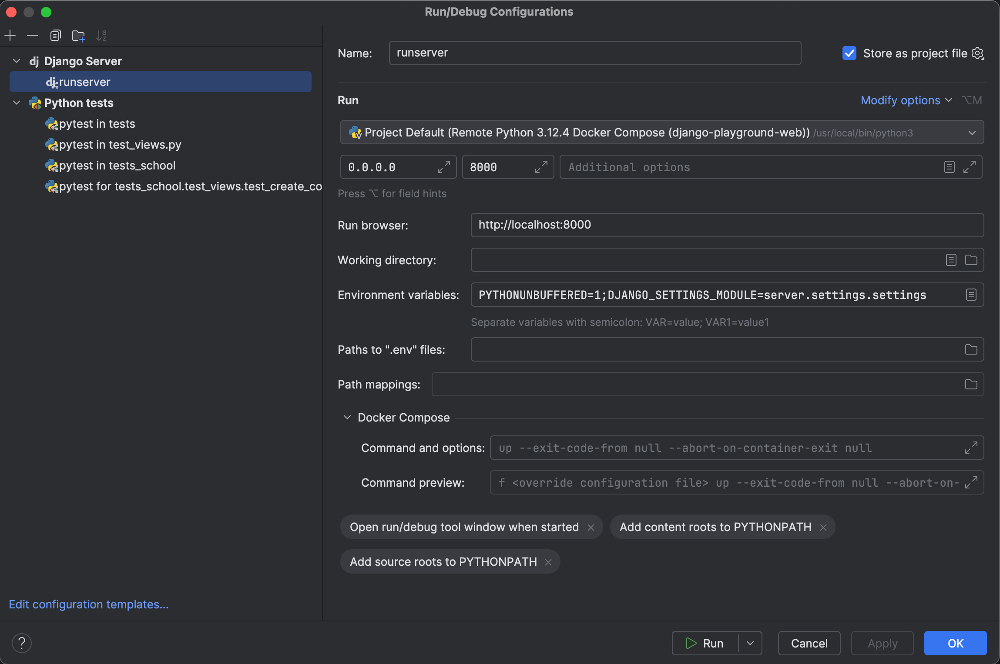
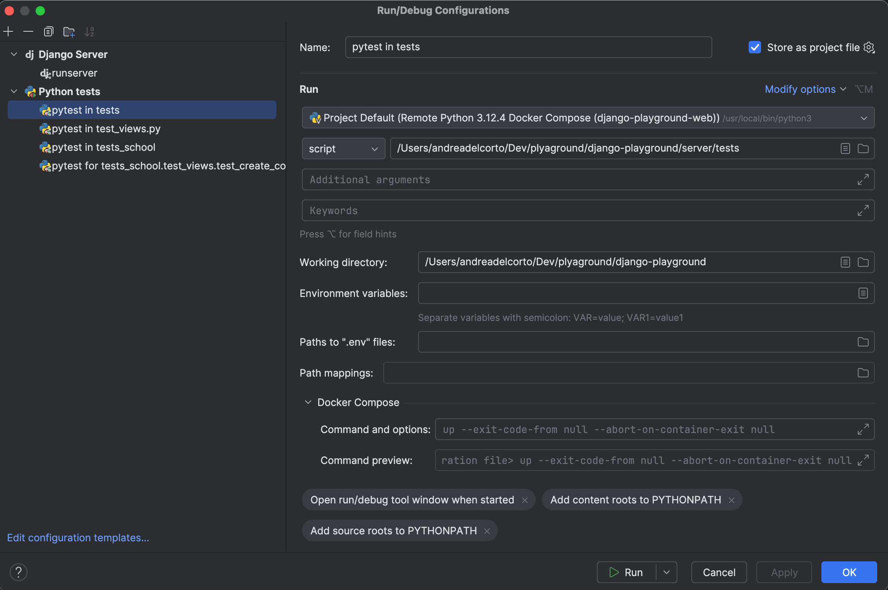
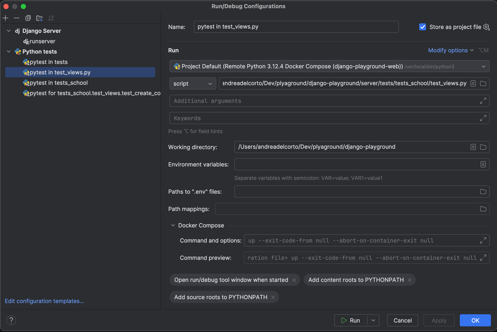
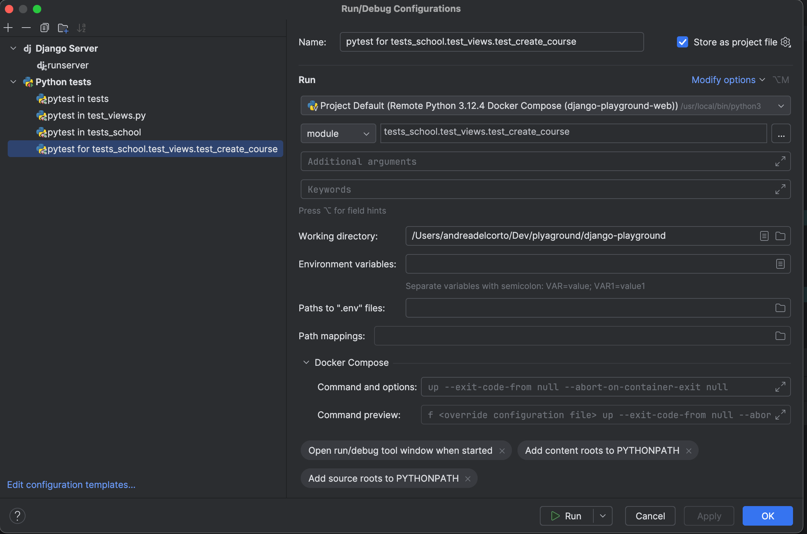
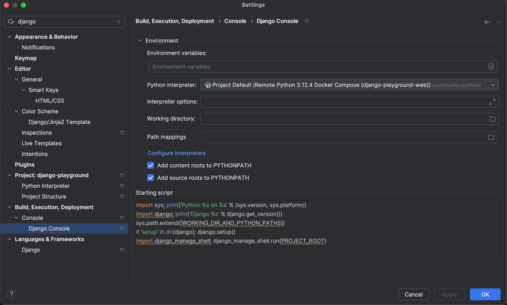
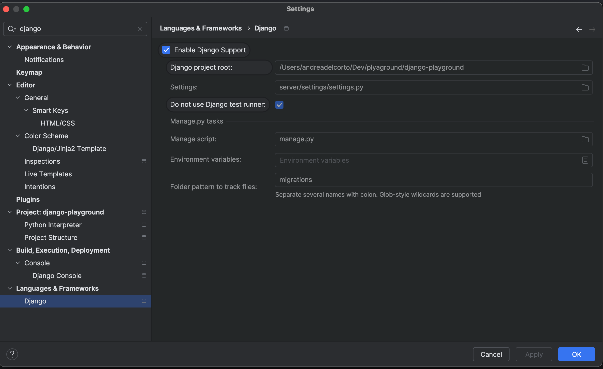
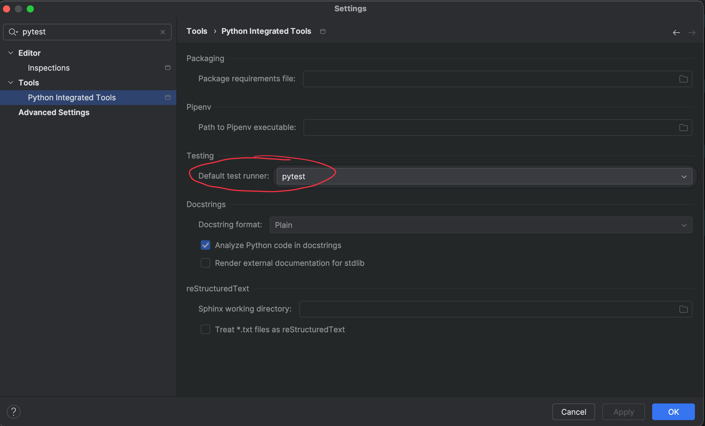

# Django Playground

A simple Django project to play around with Django features.

> Warning: This project is not meant to be used in production !!!

## Key Features
This simple project use the following libraries:
- djangorestframework: for building APIs
- django: the web framework
- pytest-django: for testing


## Requirements

- [Docker](https://www.docker.com/)
- [Poetry](https://python-poetry.org/)


## Useful commands

`docker compose` and `docker` are your best friends here!
Check the [official documentation](https://docs.docker.com/) for more information. Here below some useful commands:

```bash
# Build required images
docker compose build 
```

```bash
# Build required images without using caching
docker compose build --no-cache
```

```bash
# Run a command inside the container
docker compose exec web <command>
```

```bash
# Add a new python package 
docker compose exec web poetry add <package_name>
```

```bash
# Run all tests
docker compose exec web pytest
```

```bash
# Run a specific test
docker compose exec web pytest server/tests/tests_school/test_views.py::test_create_course
```

```bash
# Start the project
docker compose up
```

```bash
# Cleanup docker stuff related to this project
docker compose down -v --remove-orphans --rmi all
docker rmi -f $(docker compose images -q) 2>/dev/null
```

## Pycharm setup

- Run configurations are shared `django-playground/.idea/runConfigurations`, so hopefully pycharm should work out of the
  box 🤞🏻
- Create a remote python interpreter using the docker compose service `web`
  
  
  

- Make sure to have the following run configurations
  
  
  
  
  

- Make sure to have the following settings:


